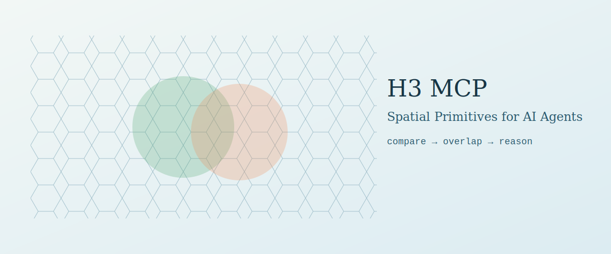

# H3 MCP



H3 MCP gives AI agents spatial reasoning by turning geospatial geometry into composable H3 set operations.

## Quick Start
1. Install dependencies:
```bash
python3.14 -m venv .venv
. .venv/bin/activate
pip install -r requirements.txt -r requirements-dev.txt
```
2. Start the server in development mode:
```bash
mcp dev src/h3_mcp/server.py
```
3. Run tests:
```bash
pytest -q
```

## Architecture
```text
Data Sources (GeoJSON/coords) -> H3 MCP tools -> summaries + cellset handles -> LLM reasoning
```

The LLM orchestrates tool calls and reasons on summaries. Raw cell arrays are optional and capped by output controls.

## Tool Reference
| Tool | Purpose | Output style |
|---|---|---|
| `h3_geo_to_cells` | Index GeoJSON into H3 cells | `summary`, `stats`, `cells` |
| `h3_k_ring` | Expand service areas | `summary`, `stats`, `cells` |
| `h3_change_resolution` | Move up/down H3 hierarchy | `summary`, `stats`, `cells` |
| `h3_compare_sets` | Pairwise overlap metrics | summary + optional cells |
| `h3_compare_many` | N-way comparison | `summary`, `stats` |
| `h3_cells_to_geojson` | Convert cells to polygons | `summary`, `geojson` |
| `h3_cell_stats` | Cell metadata and contiguity | summary |
| `h3_aggregate` | Roll up numeric attributes | `summary`, `stats`, `items` |
| `h3_find_hotspots` | Neighborhood z-score outliers | `summary`, `stats`, `items` |
| `h3_distance_matrix` | Origin-destination hop distances | `summary`, `stats`, `items` |

## Why MCP, Not REST?
- MCP tools are composable primitives, not fixed workflows.
- The agent can chain tools differently per question without new endpoints.
- Tool annotations and schemas improve model planning and safe execution.

## Coordinate Hallucination Prevention
- Use batch GeoJSON ingestion (`h3_geo_to_cells`) instead of single lat/lng prompts.
- Pass `cellset_id` handles between tools to avoid large token payloads.
- Default to `return_mode="summary"` and only request raw arrays when necessary.

## Examples
- `examples/waste_container_analysis.md`
- `examples/solar_grid_mismatch.md`

## License
MIT (see `LICENSE`).
